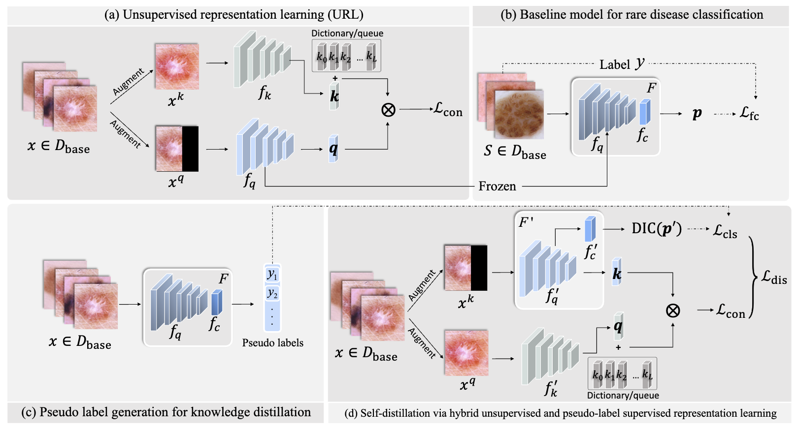

# Hybrid unsupervised representation learning and pseudo-label supervised self-distillation for rare disease imaging phenotype classification with dispersion-aware imbalance correction
This repo contains the reference source code for the paper [**Hybrid unsupervised representation learning and pseudo-label supervised self-distillation for rare disease imaging phenotype classification with dispersion-aware imbalance correction**](https://www.sciencedirect.com/science/article/abs/pii/S1361841524000276) in Medical Image Analysis. In this project, we provide a hybrid representation learning approach for rare disease classification. Our implementation is based on [Pytorch](https://pytorch.org/).
<div align="center">
	
</div>


### Run the code
**Unsupervised representation learning (URL)**

Run unsupervised representation learning on the base dataset. 


```
python main_moco.py \
 --arch resnet12 \
 --epochs 200 -b 16 -j 4 \
 --dist-url 'tcp://localhost:10001' --multiprocessing-distributed --world-size 1 --rank 0 \
 --moco-k 1280  \
 [data_folder] --model_path [path to save model]  
```
Path flags:
- `data_folder`: specify the data folder.
- `--model_path`: specify the path to save model.

MoCo flags:
- `--moco-k`: number of negatives to contrast for each positive. Default: 1280


**Self-distillation via hybrid unsupervised and pseudo-label supervised representation learning**


```
python main_distill_DIC.py \
 --arch resnet12 \
 --epochs 200 -b 16 -j 4 \
 --dist-url 'tcp://localhost:10002' --multiprocessing-distributed --world-size 1 --rank 0 \
 --moco-k 1280 \
 [data_folder] --model_path [model saving path] --savedir [pseudo labels saving path] \
 --p_label --n_way 3 --k_shot 5 
```

Path flags:
- `data_folder`: specify the data folder.
- `--model_path`: specify the path to save model.
- `--savedir`: specify the path of pseudo labels.

MoCo flags:
- `--moco-k`: number of negatives to contrast for each positive. Default: 1280

**Linear Classification**


```
python -u test.py \
 --gpu [gpu_id] \
 --arch resnet12 \
 --n_way 3 --k_shot 5 \
 --load_cla \
 --resume [pretrained_model_path]
 [data_folder]
```
Path flags:
- `data_folder`: specify the data folder.
- `resume`: specify the path of trained model.

## Citation
Please cite our paper if the code is helpful to your research.
```
@article{sun2024hybrid,
  title={Hybrid unsupervised representation learning and pseudo-label supervised self-distillation for rare disease imaging phenotype classification with dispersion-aware imbalance correction},
  author={Sun, Jinghan and Wei, Dong and Wang, Liansheng and Zheng, Yefeng},
  journal={Medical Image Analysis},
  volume={93},
  pages={103102},
  year={2024},
  publisher={Elsevier}
}
```

## Concact
If you have any question, please feel free to concat Jinghan Sun (Email: jhsun@stu.xmu.edu.cn)