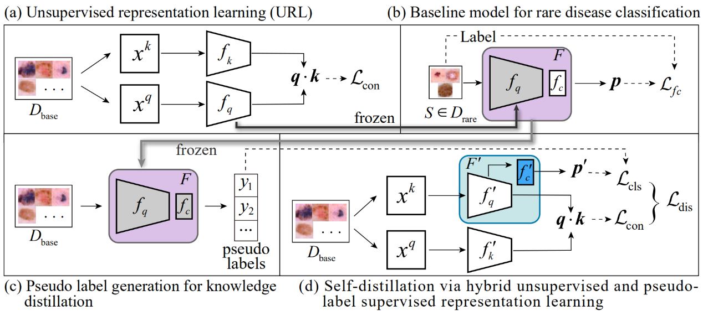

# Hybrid Representation Learning Approach for Rare Disease Classification
This repo contains the reference source code for the paper [**Unsupervised Representation Learning Meets Pseudo-Label Supervised Self-Distillation: A New Approach to Rare Disease Classification**](https://link.springer.com/chapter/10.1007%2F978-3-030-87240-3_50) in MICCAI2021. In this project, we provide a hybrid representation learning approach for rare disease classification. Our implementation is based on [Pytorch](https://pytorch.org/).
<div align="center">
	
</div>

This repository was built off of [MoCo: Momentum Contrast for Unsupervised Visual Representation Learning](https://github.com/facebookresearch/moco).

Our extended version of the journal (Medical Image Analysis): Hybrid unsupervised representation learning and pseudo-label supervised self-distillation for rare disease imaging phenotype classification with dispersion-aware imbalance correction, can be found here: [Hbr.Dst.-DIC](1-s2.0-S1361841524000276-main.pdf)

### Prerequisites
Install python dependencies.
```
$ pip install -r requirements.txt
```

### Data preparation
The 2018 skin lesion classification dataset are available [here](https://challenge2018.isic-archive.com/task3/).

### Run the code
**(a) Unsupervised representation learning (URL)**

Run unsupervised representation learning on the base dataset. 


```
python main_moco.py \
 --arch resnet12 \
 --epochs 200 -b 16 -j 4 \
 --dist-url 'tcp://localhost:10001' --multiprocessing-distributed --world-size 1 --rank 0 \
 --moco-k 1280  \
 [data_folder] --model_path [path to save model]  
```
Path flags:
- `data_folder`: specify the data folder.
- `--model_path`: specify the path to save model.

MoCo flags:
- `--moco-k`: number of negatives to contrast for each positive. Default: 1280

**(b)—(c) Generate pseudo labels**


```
python generate_pseudo.py \
 --arch resnet12 \
 --n_way 3 --k_shot 5 --k_query 15 \
 --resume [pretrained_model_path]
 --datadir [data_folder] 
 --savedir [pseudo labels saving path]
```
Path flags:
- `--resume`: specify the path of unsupervised pretrained model.
- `--datadir`: specify the data folder.
- `--savedir`: specify the path to save pseudo labels.

**(d) Self-distillation via hybrid unsupervised and pseudo-label supervised representation learning**


```
python main_distill.py \
 --arch resnet12 \
 --epochs 200 -b 16 -j 4 \
 --dist-url 'tcp://localhost:10002' --multiprocessing-distributed --world-size 1 --rank 0 \
 --moco-k 1280 \
 [data_folder] --model_path [model saving path] --savedir [pseudo labels saving path] \
 --p_label --n_way 3 --k_shot 5 
```

Path flags:
- `data_folder`: specify the data folder.
- `--model_path`: specify the path to save model.
- `--savedir`: specify the path of pseudo labels.

MoCo flags:
- `--moco-k`: number of negatives to contrast for each positive. Default: 1280

**Linear Classification**


```
python -u test.py \
 --gpu [gpu_id] \
 --arch resnet12 \
 --n_way 3 --k_shot 5 \
 --load_cla \
 --resume [pretrained_model_path]
 [data_folder]
```
Path flags:
- `data_folder`: specify the data folder.
- `resume`: specify the path of trained model.

## Citation
Please cite our paper if the code is helpful to your research.
```
@inproceedings{sun2021unsupervised,
  title={Unsupervised Representation Learning Meets Pseudo-Label Supervised Self-Distillation: A New Approach to Rare Disease Classification},
  author={Sun, Jinghan and Wei, Dong and Ma, Kai and Wang, Liansheng and Zheng, Yefeng},
  booktitle={International Conference on Medical Image Computing and Computer-Assisted Intervention},
  pages={519--529},
  year={2021},
  organization={Springer}
}
```

## Concact
If you have any question, please feel free to concat Jinghan Sun (Email: jhsun@stu.xmu.edu.cn)
